# 添加菜品与菜谱创建流程图

本文档描述用户从添加菜品、完善菜品信息、保存为草稿或可用菜品，到选择已有菜谱或创建新菜谱并加入菜品的主链路。

适用口径：

- 菜品是独立对象，菜谱只引用用户自己的菜品。
- 新建菜品默认可先保存为 `draft` 草稿；用户也可以直接保存为 `active` 可用菜品。
- 私有可用菜品没有发布概念，不需要审核即可加入菜谱和饭局候选菜。
- 草稿菜品不能加入菜谱、不能作为饭局候选菜、不能公开。
- 菜品图片可为空；未上传图片且未使用 AI 生成图时，展示后台配置的默认占位图。

```mermaid
%%{init: {"theme":"base","themeVariables":{"fontFamily":"Inter, PingFang SC, Microsoft YaHei, sans-serif","primaryColor":"#F8FAFC","primaryTextColor":"#0F172A","primaryBorderColor":"#CBD5E1","lineColor":"#64748B"},"flowchart":{"curve":"linear","nodeSpacing":44,"rankSpacing":48,"padding":14}}}%%
flowchart LR
    subgraph P1["1. 选择录入方式"]
        direction TB
        A([添加菜品]):::start
        B{选择录入方式?}:::decision
        C[手动录入]:::action
        D[AI 文本或长截图解析<br/>填充菜品草稿]:::ai
        E[打卡识别入口<br/>生成菜品草稿]:::ai
        F[进入菜品编辑表单]:::system
        A --> B
        B -->|手动| C --> F
        B -->|AI 解析| D --> F
        B -->|打卡识别| E --> F
    end

    subgraph P2["2. 完善菜品信息"]
        direction TB
        G[填写或确认基础信息<br/>菜名 / 分类 / 最多3个标签]:::action
        H[维护配料列表<br/>配料名 / 数量 / 单位 / 备注]:::action
        I[维护基础份量<br/>做法和备注]:::action
        J{是否设置图片?}:::decision
        K[上传图片或 AI 生成图<br/>通过图片审查后绑定]:::system
        L[不设置图片<br/>使用默认占位图]:::muted
        G --> H --> I --> J
        J -->|是| K
        J -->|否| L
    end

    subgraph P3["3. 保存菜品"]
        direction TB
        M{保存方式?}:::decision
        N[保存草稿 draft<br/>仅创建者可见]:::state
        O[保存为可用 active<br/>默认私有且不审核]:::complete
        P([菜品保存完成]):::complete
        M -->|保存草稿| N --> P
        M -->|保存为可用| O --> P
    end

    subgraph P4["4. 创建或加入菜谱"]
        direction TB
        Q{是否加入菜谱?}:::decision
        R([结束<br/>留在我的菜品库]):::complete
        S{菜品是否 active?}:::decision
        S1[提示先保存为可用菜品]:::error
        T{选择菜谱方式?}:::decision
        U[选择已有菜谱]:::action
        V[新建菜谱<br/>填写名称和备注]:::action
        W[加入菜谱菜品关系<br/>记录排序和添加时间]:::system
        X([菜谱可用于饭局选菜]):::complete
        Q -->|否| R
        Q -->|是| S
        S -->|否| S1
        S -->|是| T
        T -->|已有菜谱| U --> W
        T -->|新建菜谱| V --> W
        W --> X
    end

    F --> G
    K --> M
    L --> M
    P --> Q

    style P1 fill:#F8FAFC,stroke:#CBD5E1,stroke-width:1px,color:#334155;
    style P2 fill:#F8FAFC,stroke:#CBD5E1,stroke-width:1px,color:#334155;
    style P3 fill:#F8FAFC,stroke:#CBD5E1,stroke-width:1px,color:#334155;
    style P4 fill:#F8FAFC,stroke:#CBD5E1,stroke-width:1px,color:#334155;

    classDef start fill:#DCFCE7,stroke:#16A34A,color:#14532D,stroke-width:1.5px;
    classDef complete fill:#E0F2FE,stroke:#0284C7,color:#0C4A6E,stroke-width:1.5px;
    classDef action fill:#FFFFFF,stroke:#64748B,color:#0F172A,stroke-width:1.2px;
    classDef system fill:#EFF6FF,stroke:#2563EB,color:#1E3A8A,stroke-width:1.2px;
    classDef decision fill:#FFF7ED,stroke:#F97316,color:#7C2D12,stroke-width:1.4px;
    classDef state fill:#F1F5F9,stroke:#475569,color:#0F172A,stroke-width:1.2px;
    classDef ai fill:#F5F3FF,stroke:#7C3AED,color:#4C1D95,stroke-width:1.2px;
    classDef error fill:#FEF2F2,stroke:#EF4444,color:#7F1D1D,stroke-width:1.2px;
    classDef muted fill:#F8FAFC,stroke:#94A3B8,color:#475569,stroke-width:1px;
```

边界说明：

- AI 文本解析、长截图解析和打卡识别只填充菜品草稿；用户必须确认或补全字段后再保存。
- AI 能力不可用、积分不足、限额不足、模型调用失败时，不覆盖用户已有表单内容；已扣积分按积分规则退还。
- 图片上传阶段使用阿里云同步图片审查；审查不通过时上传失败，不绑定图片，不进入后续 AI 识别或展示链路。
- 菜品图片生成失败时不保存图片；用户仍可继续手动上传图片或留空使用默认占位图。
- 分类、标签和单位由后台固定维护，第一版用户不能自定义。
- 菜谱只引用用户自己的菜品；草稿菜品不能加入菜谱，已下架菜品保留历史关系但创建新饭局时默认不可选。
- 菜谱备注用于保存自然语言偏好，例如“软烂、清淡、少油”或“喜欢辣、重口味”。
- 菜品公开、公开审核、推荐池和首页推荐不属于本图主链路；私有菜品保存为可用不触发审核。
