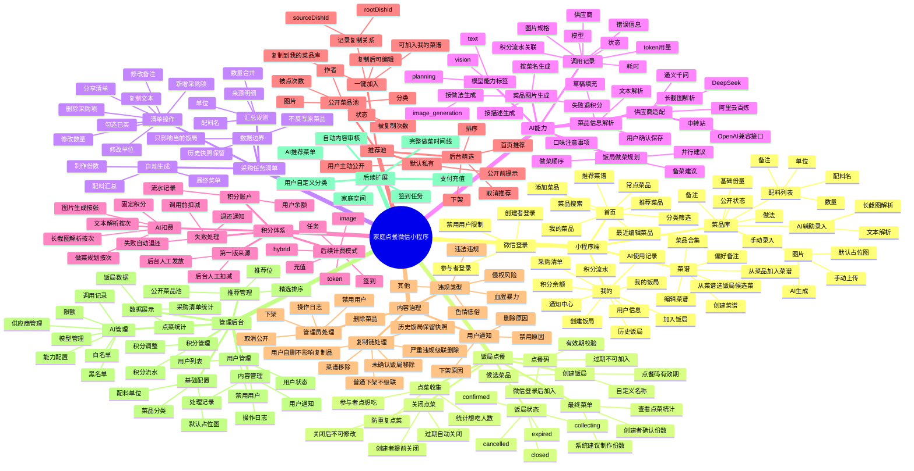

# 家庭点餐微信小程序功能点思维导图

本文是 `family-menu-miniapp-prd.md` 的功能点视图，用于快速查看第一版产品范围、后台能力和后续扩展方向。

```mermaid
mindmap
  root((家庭点餐微信小程序))
    小程序端
      微信登录
        创建者登录
        参与者登录
        禁用用户限制
      首页
        我的菜品
        分类筛选
        菜品搜索
        添加菜品
        最近编辑菜品
        常点菜品
        推荐菜品
        推荐菜谱
      菜品库
        手动录入
        AI辅助录入
          文本解析
          长截图解析
        图片
          手动上传
          AI生成
          默认占位图
        基础份量
        配料列表
          配料名
          数量
          单位
          备注
        做法
        备注
        公开状态
      菜谱
        创建菜谱
        编辑菜谱
        菜品合集
        偏好备注
        从菜品加入菜谱
        从菜谱选饭局候选菜
      我的
        用户信息
        积分余额
        积分流水
        AI使用记录
        创建饭局
        加入饭局
        我的饭局
        历史饭局
        采购清单
        通知中心
    饭局点餐
      创建饭局
        自定义名称
        点餐码有效期
        候选菜品
      点餐码
        微信登录后加入
        有效期校验
        过期不可加入
      点菜收集
        参与者点想吃
        统计想吃人数
        防重复点菜
      关闭点菜
        创建者提前关闭
        过期自动关闭
        关闭后不可修改
      最终菜单
        查看点菜统计
        系统建议制作份数
        创建者确认份数
      饭局状态
        collecting
        closed
        confirmed
        expired
        cancelled
    采购任务清单
      自动生成
        最终菜单
        制作份数
        配料汇总
      汇总规则
        配料名
        单位
        数量合并
        来源明细
      清单操作
        勾选已买
        新增采购项
        修改数量
        修改单位
        修改备注
        删除采购项
        复制文本
        分享清单
      数据边界
        只影响当前饭局
        不反写原菜品
        历史快照保留
    AI能力
      菜品信息解析
        文本解析
        长截图解析
        草稿填充
        用户确认保存
      菜品图片生成
        按菜名生成
        按描述生成
        按做法生成
        失败退积分
      饭局做菜规划
        做菜顺序
        备菜建议
        并行建议
        口味注意事项
      供应商适配
        通义千问
        阿里云百炼
        DeepSeek
        中转站
        OpenAI兼容接口
      模型能力标签
        text
        vision
        image_generation
        planning
      调用记录
        供应商
        模型
        耗时
        状态
        错误信息
        token用量
        图片规格
        积分流水关联
    积分体系
      积分账户
        用户余额
        流水记录
      第一版来源
        后台人工发放
        后台人工扣减
      AI扣费
        固定积分
        文本解析按次
        长截图解析按次
        图片生成按张
        做菜规划按次
      失败处理
        调用前扣减
        失败自动退还
        退还通知
      后续计费模式
        token
        image
        hybrid
        充值
        签到
        任务
    推荐池
      默认私有
        用户主动公开
        公开前提示
      公开菜品池
        被点次数
        被复制次数
        分类
        图片
        作者
        状态
      后台精选
        首页推荐
        排序
        下架
        取消推荐
      一键加入
        复制到我的菜品库
        可加入我的菜谱
        复制后可编辑
        记录复制关系
          sourceDishId
          rootDishId
    内容治理
      违规类型
        色情低俗
        血腥暴力
        违法违规
        侵权风险
        其他
      管理员处理
        取消公开
        下架
        删除菜品
        禁用用户
        操作日志
      用户通知
        删除原因
        下架原因
        禁用原因
      复制链处理
        严重违规级联删除
        普通下架不级联
        用户自删不影响复制品
        菜谱移除
        未确认饭局移除
        历史饭局保留快照
    管理后台
      用户管理
        用户列表
        用户状态
        禁用用户
      积分管理
        积分调整
        积分流水
      基础配置
        菜品分类
        配料单位
        默认占位图
      AI管理
        供应商管理
        模型管理
        能力配置
        调用记录
        限额
        白名单
        黑名单
      推荐管理
        公开菜品池
        推荐位
        精选排序
      内容管理
        处理记录
        用户通知
        操作日志
      数据展示
        饭局数据
        点菜统计
        采购清单统计
    后续扩展
      家庭空间
      支付充值
      签到任务
      用户自定义分类
      AI推荐菜单
      完整做菜时间线
      自动内容审核
```
