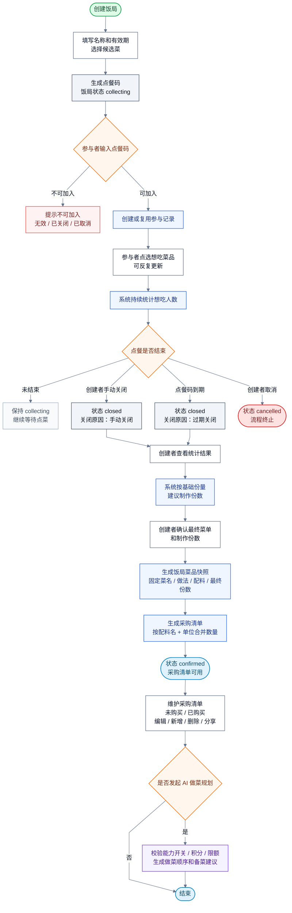

# 饭局点餐到采购清单流程图

本文档描述从创建饭局、参与者点菜、关闭点餐、确认最终菜单到生成采购清单的主链路。

适用口径：

- 饭局主状态为 `collecting`、`closed`、`confirmed`、`cancelled`。
- 点餐码过期不作为独立主状态，而是 `closed` 的关闭原因。
- 点餐阶段不保存完整菜品快照，确认最终菜单时才生成饭局菜品快照。
- 采购清单不维护采购主状态，清单项只区分未购买和已购买。
- AI 做菜规划是确认菜单后的可选能力，发起一次按后台配置消耗积分。

边界说明：

- 候选菜被用户下架时，当前饭局候选项保留并标记“已下架”。
- 创建者从候选菜单移除菜品时，参与者端不再展示，相关点菜记录不计入最终菜单。
- 点餐阶段不保存完整菜品快照，只有创建者确认最终菜单和制作份数后才生成饭局菜品快照。
- 采购清单不维护采购主状态，整体进度由清单项“未购买 / 已购买”推导。
